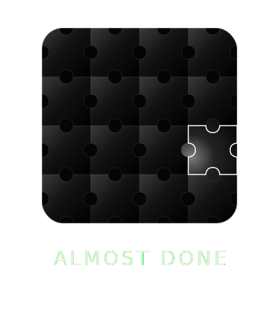

<div align="center">

<!-- Replace with your logo -->


# Almost Done

**一个关于「还差一点」的目标追踪器**
*A goal tracker about the beauty of "almost there"*

[](https://react.dev)
[](https://vitejs.dev)
[](https://tailwindcss.com)
[](https://www.framer-motion.com)
[](LICENSE)

[English](#english) · [中文](#中文) · [Live Demo](#) · [Screenshots](#-screenshots)

</div>

---

<a name="中文"></a>

## 🧩 为什么叫「Almost Done」？

> *"人生中最美的状态，不是终点，而是那个还差一点点的瞬间。"*

「Almost Done」不是一个提醒你「还没做完」的工具——它是一个帮你**看见进展**的工具。

每一个目标，都像一幅巨大的拼图。每一次打卡记录，都是你亲手嵌入画面的一块碎片。当拼图越来越完整，你会清晰地感受到：每一个微小的坚持，都在构建一幅更宏大的人生图景。

那块**永远缺失的角**——是设计上的刻意留白。它在提醒你：**完成不是终点，成长才是。**

---

## ✨ 核心特性

### 🎨 Apple 级精致 UI
基于 iOS / macOS Human Interface Guidelines 设计，使用 Glassmorphism 玻璃拟态风格，支持完整暗黑模式，每一个交互都有精心调校的 Spring 弹性动画。

### 🧩 独特的进度可视化系统
三种可随时切换的进度展示模式，针对不同的心理激励需求：

| 模式 | 图标 | 适合场景 | 特点 |
|------|------|----------|------|
| **线形** | `━━━` | 日常数字目标 | 简洁，即时感知进度数值 |
| **环形** | `◎` | 长期百分比目标 | 视觉冲击，完成感强 |
| **拼图** | `⊞` | 需要仪式感的目标 | 每次打卡嵌入一块，成就感满满 |

### 📊 数据统计看板
由 Recharts 驱动的可视化分析页面，包含：
- 📈 **折线图** — 累计进度趋势（7天 / 30天切换）
- 📊 **柱状图** — 每日活跃度热力分析
- 🍩 **环形图** — 目标完成分布

### 🔒 Privacy First · 纯本地存储
所有数据存储在浏览器 `localStorage`，**零服务器、零账号、零上传**。你的目标只属于你。

### 📱 PWA · 可安装到桌面 / 手机
配置了 Workbox Service Worker，支持离线运行，可一键安装到桌面或手机主屏幕，体验与原生 App 无异。

### 🎉 细节彩蛋
- 目标完成瞬间触发 **canvas-confetti 彩屑庆典** 🎊
- 智能预测：基于近 7 天平均进度，估算完成所需天数
- 每日打卡提醒（「今日尚未打卡」状态标识）
- 历史记录可逐条删除并自动回滚进度

---

## 📸 Screenshots

> 📌 *截图占位符 — 请替换为实际应用截图*

| 目标列表（线形模式） | 拼图进度模式 | 数据统计看板 |
|:---:|:---:|:---:|
| `[screenshot-goals.png]` | `[screenshot-puzzle.png]` | `[screenshot-analytics.png]` |

| 移动端底部导航 | 暗黑模式 | PWA 安装 |
|:---:|:---:|:---:|
| `[screenshot-mobile.png]` | `[screenshot-dark.png]` | `[screenshot-pwa.png]` |

---

## 🛠️ 技术栈

| 类别 | 技术 | 版本 | 用途 |
|------|------|------|------|
| **框架** | [React](https://react.dev) | 18 | UI 组件与状态管理 |
| **构建工具** | [Vite](https://vitejs.dev) | 5 | 开发服务器与生产构建 |
| **样式** | [Tailwind CSS](https://tailwindcss.com) | 3 | Utility-first 原子样式 |
| **动画** | [Framer Motion](https://www.framer-motion.com) | 12 | Spring 弹性动画系统 |
| **图表** | [Recharts](https://recharts.org) | 3 | 数据可视化看板 |
| **图标** | [Lucide React](https://lucide.dev) | — | SVG 图标库 |
| **PWA** | [vite-plugin-pwa](https://vite-pwa-org.netlify.app) | — | Service Worker & Manifest |
| **彩屑** | [canvas-confetti](https://github.com/catdad/canvas-confetti) | — | 目标完成庆典动效 |
| **持久化** | Web `localStorage` | — | 本地数据存储 |

---

## 🚀 快速开始

### 环境要求

- Node.js `>= 18.0`
- npm `>= 9.0`

### 安装与运行

```bash
# 1. 克隆仓库
git clone https://github.com/YOUR_USERNAME/almost-done.git
cd almost-done

# 2. 安装依赖
npm install

# 3. 启动开发服务器
npm run dev
```

打开浏览器访问 **http://localhost:5173**

### 其他命令

```bash
# 生产构建
npm run build

# 预览生产构建（包含 PWA / Service Worker）
npm run preview

# 重新生成应用图标
node scripts/gen-icons.mjs
```

---

## 📁 项目结构

```
almost-done/
├── public/
│   ├── logo.svg              # 品牌 Logo（金属拼图风格）
│   ├── favicon.png           # 浏览器标签图标
│   ├── apple-touch-icon.png  # iOS 主屏图标
│   └── icons/                # PWA 图标（各尺寸）
├── scripts/
│   └── gen-icons.mjs         # 图标批量生成脚本
├── src/
│   ├── components/
│   │   ├── progress/
│   │   │   ├── LinearProgress.jsx   # 线形进度条
│   │   │   ├── CircleProgress.jsx   # 环形 SVG 进度
│   │   │   └── PuzzleProgress.jsx   # 真实 SVG 拼图进度 ⭐
│   │   ├── GoalCard.jsx             # 目标卡片（含三种模式切换）
│   │   ├── AddGoalModal.jsx         # 新建目标弹窗
│   │   ├── EditGoalModal.jsx        # 编辑目标弹窗
│   │   ├── UpdateProgressModal.jsx  # 更新进度弹窗
│   │   ├── HistoryLog.jsx           # 打卡历史列表
│   │   ├── Sidebar.jsx              # 桌面侧边栏
│   │   └── BottomNav.jsx            # 移动端底部标签栏
│   ├── hooks/
│   │   ├── useGoals.js              # 目标 CRUD + localStorage
│   │   ├── useCountUp.js            # RAF 数字滚动动画
│   │   └── usePWAInstall.js         # PWA 安装提示控制
│   ├── pages/
│   │   └── AnalyticsDashboard.jsx   # 数据统计页
│   ├── utils/
│   │   ├── analytics.js             # 预测算法 & 打卡检测
│   │   └── chartData.js             # Recharts 数据处理
│   ├── App.jsx                      # 根组件 & 路由逻辑
│   ├── main.jsx                     # React 入口
│   └── index.css                    # 全局样式 & iOS 设计 Token
├── index.html
├── vite.config.js
├── tailwind.config.js
└── package.json
```

---

## 🗺️ Roadmap

- [x] 三种进度可视化模式（线形 / 环形 / 拼图）
- [x] 数据统计看板
- [x] PWA 离线支持
- [x] 暗黑模式
- [ ] 目标分组 / 标签系统
- [ ] 数据导入 / 导出（JSON）
- [ ] 自定义主题色
- [ ] 桌面小组件（Electron / Web Widget）
- [ ] 目标截止日期与日历视图

---

## 📄 License

MIT © 2025 · 用 ❤️ 和一点点执着构建

---

<a name="english"></a>

---

<div align="center">

# Almost Done — English

**A goal tracker built around the philosophy of "almost there"**

</div>

## 🧩 Why "Almost Done"?

> *"The most beautiful state in life isn't the finish line — it's that moment when you're almost there."*

**Almost Done** isn't a tool that reminds you what's left to do. It's a tool that helps you **see how far you've come**.

Every goal is like a giant puzzle. Every check-in is a piece you place into the picture. As the puzzle fills in, you feel the weight of every small commitment — each one building toward something larger than itself.

The **missing corner piece** is intentional. It's a reminder: *finishing isn't the destination — growing is.*

---

## ✨ Features

### 🎨 Apple-Grade UI
Designed after iOS / macOS Human Interface Guidelines. Glassmorphism aesthetics, full dark mode, and meticulously tuned spring animations on every interaction.

### 🧩 Unique Progress Visualization System
Three switchable visualization modes for different motivational needs:

| Mode | When to use | Highlight |
|------|-------------|-----------|
| **Linear** | Daily numeric goals | Clean, instant progress readout |
| **Circle** | Long-term percentage goals | Dramatic ring sweep animation |
| **Puzzle** | Goals that deserve ceremony | Each check-in locks a piece into place |

### 📊 Analytics Dashboard
Recharts-powered visual analytics featuring trend lines, daily activity bars, and goal distribution donuts.

### 🔒 Privacy First
Everything lives in browser `localStorage`. No servers, no accounts, no uploads. Your goals stay yours.

### 📱 Installable PWA
Full offline support via Workbox Service Worker. Install to desktop or mobile home screen for a native app experience.

---

## 🚀 Getting Started

```bash
git clone https://github.com/YOUR_USERNAME/almost-done.git
cd almost-done
npm install
npm run dev
```

Visit **http://localhost:5173**

---

## 🛠️ Tech Stack

`React 18` · `Vite 5` · `Tailwind CSS 3` · `Framer Motion 12` · `Recharts` · `Lucide React` · `vite-plugin-pwa` · `canvas-confetti`

---

## 📄 License

MIT © 2025 · Built with ❤️ and a little obsession
